# 作业：LMDeploy

**本文档基于：**

**https://www.bilibili.com/video/BV1tr421x75B/**

**https://github.com/InternLM/Tutorial/tree/camp2/lmdeploy**

## 1. LMDeploy环境部署

选择镜像`Cuda12.2-conda`。

创建conda环境：

```bash
studio-conda -t lmdeploy -o pytorch-2.1.2
```

激活虚拟环境：

```bash
conda activate lmdeploy
```

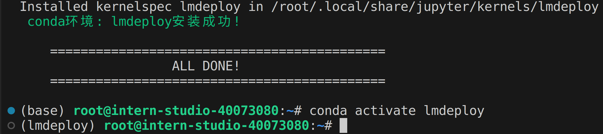

安装0.3.0版本的lmdeploy：

```bash
pip install lmdeploy[all]==0.3.0
```

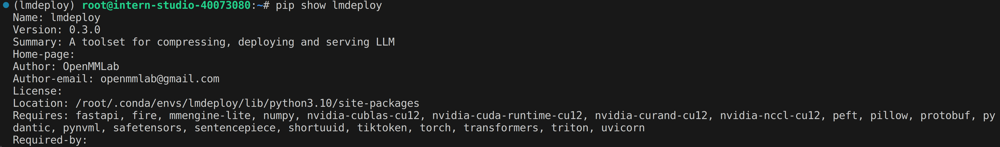

## 2. 模型下载

### 2.1 InternStudio开发机下载模型

软链接：

```bash
ln -s /root/share/new_models/Shanghai_AI_Laboratory/internlm2-chat-1_8b /root/model/
```

### 2.2 modelscope平台下载模型

#### 2.2.1 本地

```python
# modelscope1.py
# import torch
from modelscope import snapshot_download
# import os
model_dir = snapshot_download('Shanghai_AI_Laboratory/internlm2-chat-1_8b', 
                              cache_dir='/home/pika/Model/',
                              revision='master')
```

运行：

```bash
python modelscope1.py
```

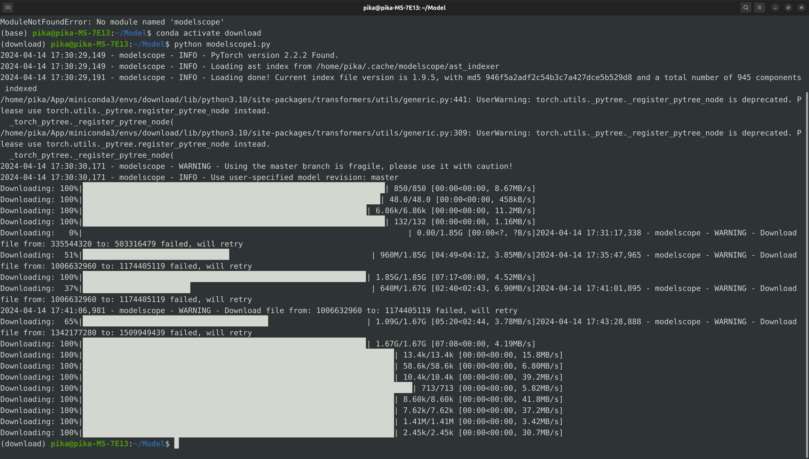

#### 2.2.2 开发机[7.2使用]

安装依赖：

```bash
pip install modelscope -U
```

```bash
touch /root/model_download.py
```

复制粘贴：

```python
from modelscope import snapshot_download
model_dir = snapshot_download('qwen/Qwen-VL', 
                              cache_dir='/root/model',
                              revision='v1.0.3')
```

运行：

```bash
python /root/model_download.py
```

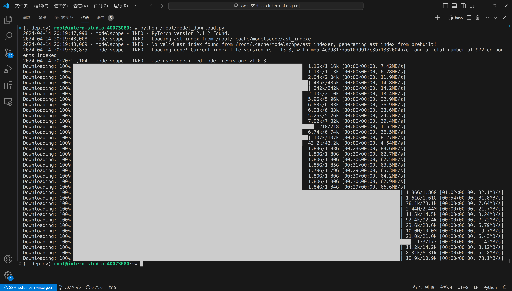

## 3. 模型对话

### 3.1 Transformer

新建python文件：

```bash
touch /root/pipeline_transformer.py
```

复制粘贴：

```python
import torch
from transformers import AutoTokenizer, AutoModelForCausalLM

tokenizer = AutoTokenizer.from_pretrained("/root/model/internlm2-chat-1_8b", trust_remote_code=True)

# Set `torch_dtype=torch.float16` to load model in float16, otherwise it will be loaded as float32 and cause OOM Error.
model = AutoModelForCausalLM.from_pretrained("/root/model/internlm2-chat-1_8b", torch_dtype=torch.float16, trust_remote_code=True).cuda()
model = model.eval()

inp = "hello"
print("[INPUT]", inp)
response, history = model.chat(tokenizer, inp, history=[])
print("[OUTPUT]", response)

inp = "please provide three suggestions about time management"
print("[INPUT]", inp)
response, history = model.chat(tokenizer, inp, history=history)
print("[OUTPUT]", response)
```

运行：

```bash
conda activate lmdeploy
python /root/pipeline_transformer.py
```

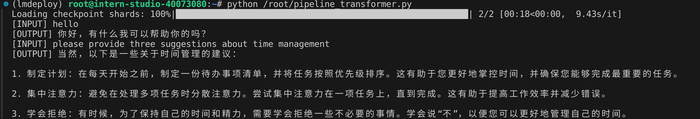

### 3.2 LMDeploy模型对话(chat)

激活虚拟环境：

```bash
conda activate lmdeploy
```

对话：

```bash
# lmdeploy chat [HF格式模型路径/TurboMind格式模型路径]
lmdeploy chat /root/model/internlm2-chat-1_8b
```

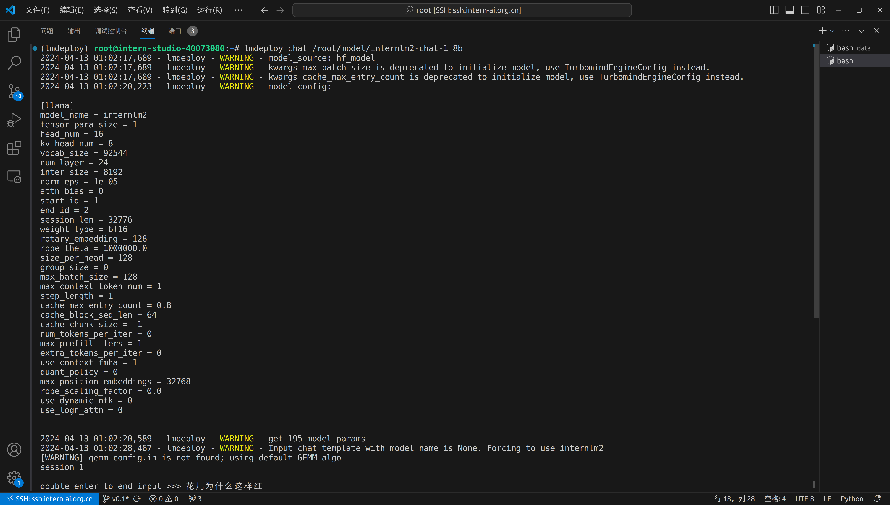

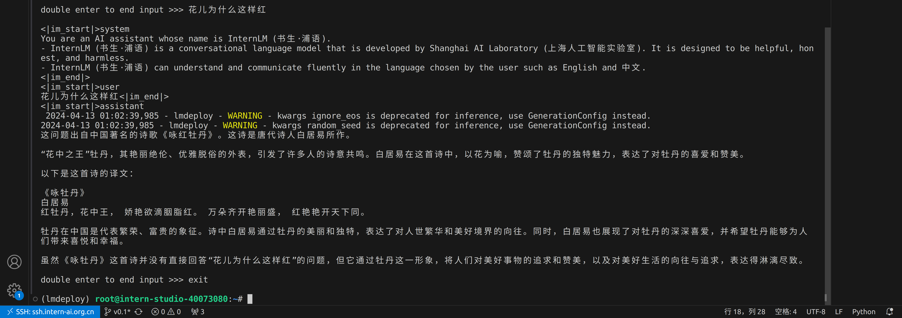

## 4. LMDeploy模型量化(lite)

**说明**：`chat`在开发机（方便观察显存变化），其余在本地vscode

**KV8量化**：将逐 Token（Decoding）生成过程中的上下文 K 和 V 中间结果进行 INT8 量化（计算时再反量化），以降低生成过程中的显存占用

**W4A16 量化**：将 FP16 的模型权重量化为 INT4，Kernel 计算时，访存量直接降为 FP16 模型的 1/4，大幅降低了访存成本。Weight Only 是指仅量化权重，数值计算依然采用 FP16（需要将 INT4 权重反量化）

### 4.1 设置最大KV Cache缓存大小

模型在运行时，占用的显存可大致分为三部分：模型参数本身占用的显存、KV Cache占用的显存，以及中间运算结果占用的显存。LMDeploy的KV Cache管理器可以通过设置`--cache-max-entry-count`参数，控制KV缓存**占用剩余显存**的最大比例。默认的比例为0.8。

默认：`--cache-max-entry-count=0.8`

```bash
lmdeploy chat /root/model/internlm2-chat-1_8b
```


`--cache-max-entry-count=0.5`：

```bash
lmdeploy chat /root/model/internlm2-chat-1_8b --cache-max-entry-count 0.5
```


`--cache-max-entry-count=0.01`：

```bash
lmdeploy chat /root/model/internlm2-chat-1_8b --cache-max-entry-count 0.01
```


### 4.2 使用W4A16量化

LMDeploy使用AWQ算法，实现模型4bit权重量化。

```bash
pip install einops==0.7.0
touch lmdeploy_awq.sh
```

复制粘贴：

```sh
#! /bin/bash

lmdeploy lite auto_awq \
   /root/model/internlm2-chat-1_8b \
  --calib-dataset 'ptb' \
  --calib-samples 128 \
  --calib-seqlen 1024 \
  --w-bits 4 \
  --w-group-size 128 \
  --work-dir /root/model/internlm2-chat-1_8b-4bit
```

运行：

```bash
bash lmdeploy_awq.sh
```

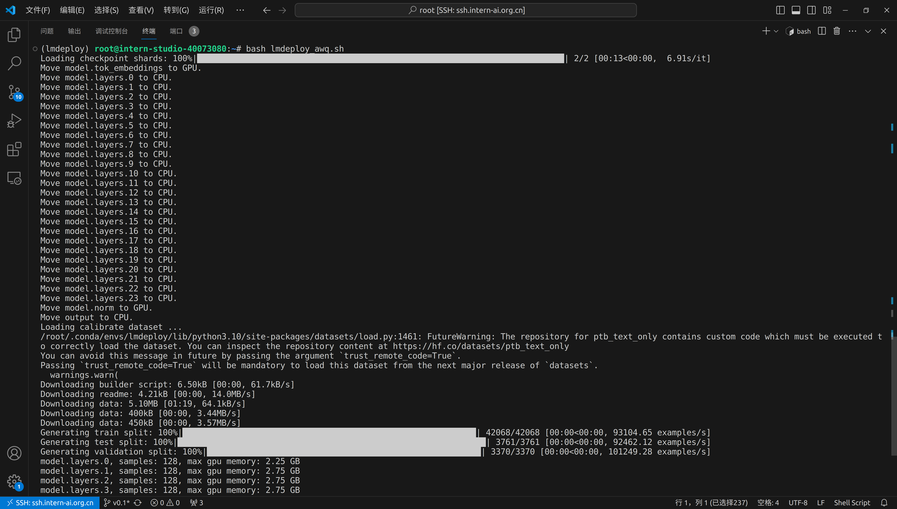

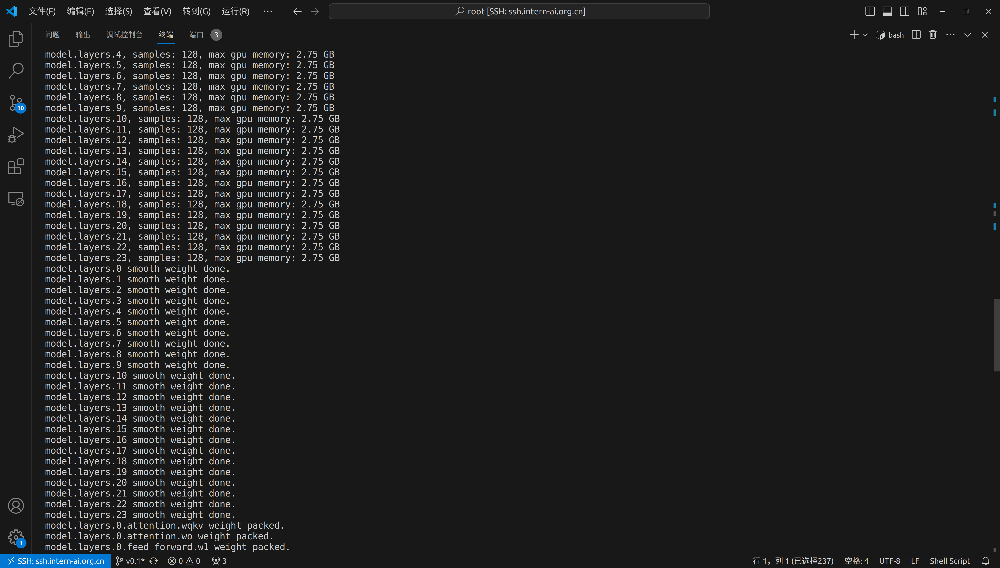

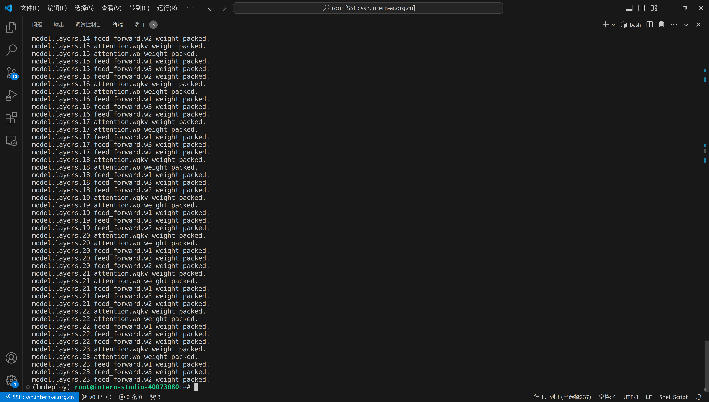

量化后对话：

```bash
lmdeploy chat /root/model/internlm2-chat-1_8b-4bit --model-format awq
```


+`--cache-max-entry-count=0.01`：

```bash
lmdeploy chat /root/model/internlm2-chat-1_8b-4bit --model-format awq --cache-max-entry-count 0.01
```


## 5. LMDeploy服务(serve)

### 5.1 启动API服务器

```bash
touch lmdeploy_api.sh
```

复制粘贴：

```bash
#! /bin/bash

lmdeploy serve api_server \
    /root/model/internlm2-chat-1_8b \
    --model-format hf \
    --quant-policy 0 \
    --server-name 0.0.0.0 \
    --server-port 23333 \
    --tp 1
```

运行：

```bash
bash lmdeploy_api.sh
```

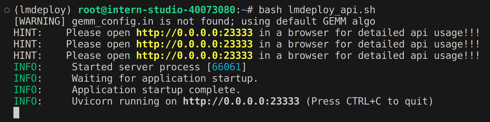

打开本地浏览器访问http://127.0.0.1:23333：


### 5.2 命令行客户端连接API服务器

新建终端，激活conda环境，运行命令行客户端：

```bash
conda activate lmdeploy
lmdeploy serve api_client http://localhost:23333
```

通过命令行窗口直接与模型对话：

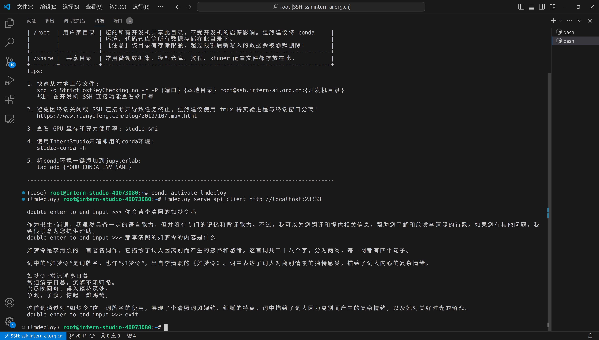

### 5.3 网页客户端连接API服务器

关闭刚刚的VSCode终端（即5.2图片右上角第二个），但服务器端的终端（即5.2图片右上角第一个）不要关闭。新建终端，激活conda环境，使用Gradio作为前端，启动网页客户端：

```bash
conda activate lmdeploy
lmdeploy serve gradio http://localhost:23333 --server-name 0.0.0.0  --server-port 6006
```

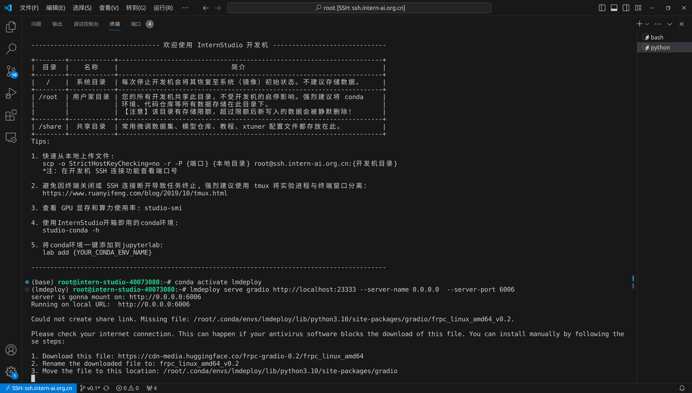

打开本地浏览器访问http://127.0.0.1:6006，对话：

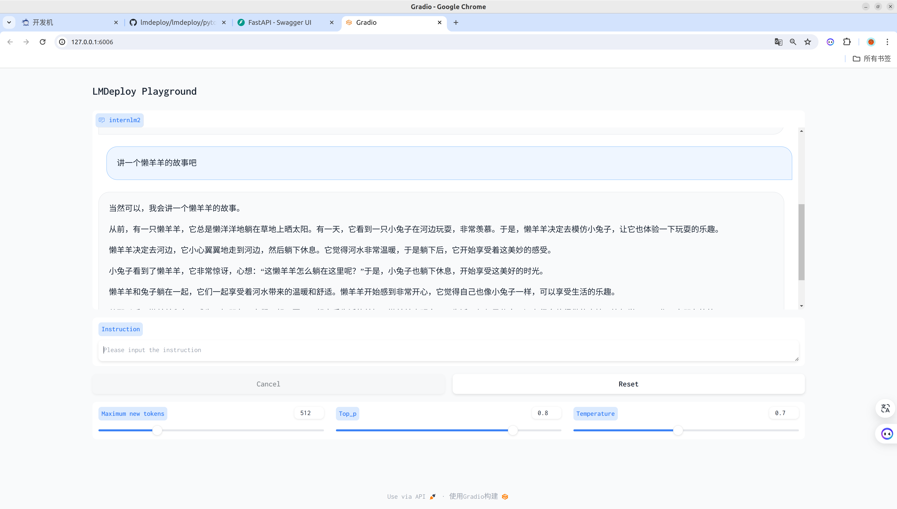

## 6. Python代码集成

### 6.1 Python代码集成运行1.8B模型

```bash
conda activate lmdeploy
touch /root/lmdeploy_pipeline.py
```

复制粘贴：

```python
# 1. 引入lmdeploy的pipeline模块
from lmdeploy import pipeline
# 2. 从目录'/root/model/internlm2-chat-1_8b'加载HF模型
pipe = pipeline('/root/model/internlm2-chat-1_8b')
# 3. 批处理：lmdeploy同时推理两个输入，产生两个输出结果，结果返回给response
response = pipe(['Hi, pls intro yourself', '上海是'])
print(response)
```

运行：

```bash
python /root/lmdeploy_pipeline.py
```


### 6.2 向TurboMind后端传递参数

```bash
touch /root/lmdeploy_pipeline_kv.py
```

复制粘贴：

```python
from lmdeploy import pipeline, TurbomindEngineConfig

# 调低 k/v cache内存占比调整为总显存的 20%
backend_config = TurbomindEngineConfig(cache_max_entry_count=0.2)

pipe = pipeline('/root/model/internlm2-chat-1_8b',
                backend_config=backend_config)
response = pipe(['Hi, pls intro yourself', '上海是'])
print(response)
```

运行：

```bash
python /root/lmdeploy_pipeline_kv.py
```

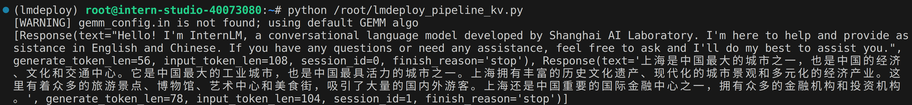

## 7. 拓展

### 7.1 使用LMDeploy运行视觉多模态大模型llava

激活conda环境，安装llava依赖库：

```bash
conda activate lmdeploy
pip install git+https://github.com/haotian-liu/LLaVA.git@4e2277a060da264c4f21b364c867cc622c945874
```

#### 7.1.1 命令行

```bash
touch /root/lmdeploy_pipeline_llava.py
```

复制粘贴：

```python
from lmdeploy.vl import load_image
from lmdeploy import pipeline, TurbomindEngineConfig

backend_config = TurbomindEngineConfig(session_len=8192) # 图片分辨率较高时请调高session_len
# pipe = pipeline('liuhaotian/llava-v1.6-vicuna-7b', backend_config=backend_config) 非开发机运行此命令
pipe = pipeline('/share/new_models/liuhaotian/llava-v1.6-vicuna-7b', backend_config=backend_config)

image = load_image('https://raw.githubusercontent.com/open-mmlab/mmdeploy/main/tests/data/tiger.jpeg')
response = pipe(('describe this image', image))
print(response)
```

运行：

```bash
python lmdeploy_pipeline_llava.py
```

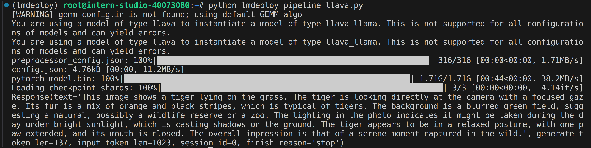

#### 7.1.2 gradio

```bash
touch /root/lmdeploy_gradio_llava.py
```

复制粘贴：

```bash
import gradio as gr
from lmdeploy import pipeline, TurbomindEngineConfig


backend_config = TurbomindEngineConfig(session_len=8192) # 图片分辨率较高时请调高session_len
# pipe = pipeline('liuhaotian/llava-v1.6-vicuna-7b', backend_config=backend_config) 非开发机运行此命令
pipe = pipeline('/share/new_models/liuhaotian/llava-v1.6-vicuna-7b', backend_config=backend_config)

def model(image, text):
    if image is None:
        return [(text, "请上传一张图片。")]
    else:
        response = pipe((text, image)).text
        return [(text, response)]

demo = gr.Interface(fn=model, inputs=[gr.Image(type="pil"), gr.Textbox()], outputs=gr.Chatbot())
demo.launch()  
```

运行：

```bash
python /root/lmdeploy_gradio_llava.py
```

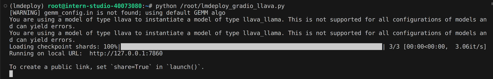

本地浏览器访问http://127.0.0.1:7860：

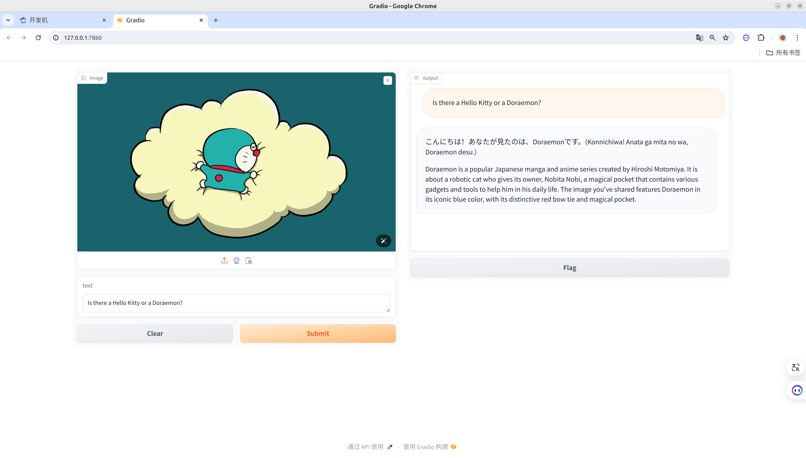

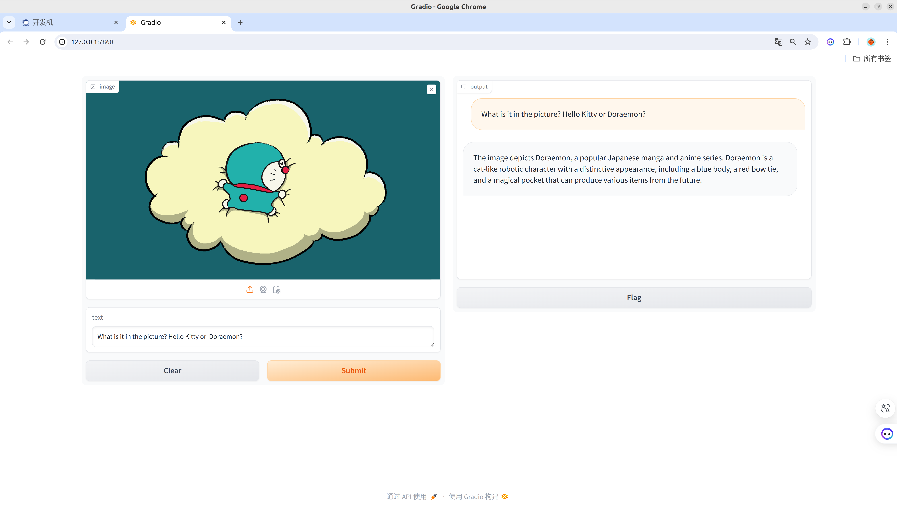

### 7.2 使用LMDeploy运行第三方大模型

根据https://www.modelscope.cn/models/qwen/Qwen-VL/summary安装依赖

**注意与7.1的区别**：

1. 修改模型路径
2. 需要添加`cache_max_entry_count=0.2`，否则OOM

#### 7.2.1 命令行

```bash
touch /root/lmdeploy_pipeline_qwenvl.py
```

复制粘贴：

```python
from lmdeploy.vl import load_image
from lmdeploy import pipeline, TurbomindEngineConfig

backend_config = TurbomindEngineConfig(session_len=8192,cache_max_entry_count=0.2) # 图片分辨率较高时请调高session_len
# pipe = pipeline('liuhaotian/llava-v1.6-vicuna-7b', backend_config=backend_config) 非开发机运行此命令
pipe = pipeline('/root/model/qwen/Qwen-VL', backend_config=backend_config)

image = load_image('https://raw.githubusercontent.com/open-mmlab/mmdeploy/main/tests/data/tiger.jpeg')
response = pipe(('describe this image', image))
print(response)
```

运行：

```bash
python /root/lmdeploy_pipeline_qwenvl.py
```

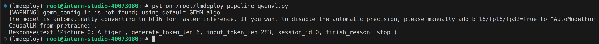

#### 7.2.2 gradio

```bash
touch /root/lmdeploy_gradio_qwenvl.py
```

复制粘贴：

```python
import gradio as gr
from lmdeploy import pipeline, TurbomindEngineConfig


backend_config = TurbomindEngineConfig(session_len=8192,cache_max_entry_count=0.2) # 图片分辨率较高时请调高session_len
# pipe = pipeline('liuhaotian/llava-v1.6-vicuna-7b', backend_config=backend_config) 非开发机运行此命令
pipe = pipeline('/root/model/qwen/Qwen-VL', backend_config=backend_config)

def model(image, text):
    if image is None:
        return [(text, "请上传一张图片。")]
    else:
        response = pipe((text, image)).text
        return [(text, response)]

demo = gr.Interface(fn=model, inputs=[gr.Image(type="pil"), gr.Textbox()], outputs=gr.Chatbot())
demo.launch()  
```

运行：

```bash
python /root/lmdeploy_gradio_qwenvl.py
```

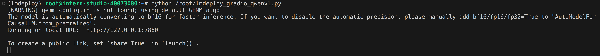

本地浏览器访问http://127.0.0.1:7860：


### 7.3 定量比较LMDeploy与Transformer库的推理速度差异

**Transformer库推理Internlm2-chat-1.8b的速度**：

```bash
touch /root/benchmark_transformer.py
```

复制粘贴：

```python
import torch
import datetime
from transformers import AutoTokenizer, AutoModelForCausalLM

tokenizer = AutoTokenizer.from_pretrained("/root/model/internlm2-chat-1_8b", trust_remote_code=True)

# Set `torch_dtype=torch.float16` to load model in float16, otherwise it will be loaded as float32 and cause OOM Error.
model = AutoModelForCausalLM.from_pretrained("/root/model/internlm2-chat-1_8b", torch_dtype=torch.float16, trust_remote_code=True).cuda()
model = model.eval()

# warmup
inp = "hello"
for i in range(5):
    print("Warm up...[{}/5]".format(i+1))
    response, history = model.chat(tokenizer, inp, history=[])

# test speed
inp = "请介绍一下你自己。"
times = 10
total_words = 0
start_time = datetime.datetime.now()
for i in range(times):
    response, history = model.chat(tokenizer, inp, history=history)
    total_words += len(response)
end_time = datetime.datetime.now()

delta_time = end_time - start_time
delta_time = delta_time.seconds + delta_time.microseconds / 1000000.0
speed = total_words / delta_time
print("Speed: {:.3f} words/s".format(speed))
```

运行：

```bash
python /root/benchmark_transformer.py
```

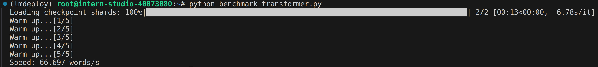

Transformer库推理速度：66.697 words/s

**LMDeploy的推理速度**：

```bash
touch /root/benchmark_lmdeploy.py
```

复制粘贴：

```python
import datetime
from lmdeploy import pipeline

pipe = pipeline('/root/model/internlm2-chat-1_8b')

# warmup
inp = "hello"
for i in range(5):
    print("Warm up...[{}/5]".format(i+1))
    response = pipe([inp])

# test speed
inp = "请介绍一下你自己。"
times = 10
total_words = 0
start_time = datetime.datetime.now()
for i in range(times):
    response = pipe([inp])
    total_words += len(response[0].text)
end_time = datetime.datetime.now()

delta_time = end_time - start_time
delta_time = delta_time.seconds + delta_time.microseconds / 1000000.0
speed = total_words / delta_time
print("Speed: {:.3f} words/s".format(speed))
```

运行：

```bash
python /root/benchmark_lmdeploy.py
```

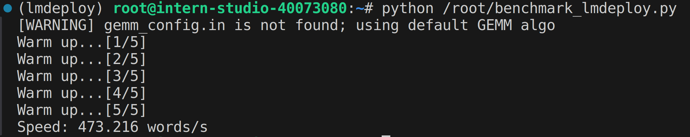

LMDeploy推理速度：473.216 words/s

## 进阶汇总

### 设置KV Cache最大占用比例为0.4，开启W4A16量化，以命令行方式与模型对话

1. 量化：见4.2

2. 对话：

   ```bash
   lmdeploy chat /root/model/internlm2-chat-1_8b-4bit --model-format awq --cache-max-entry-count 0.4
   ```

   ​	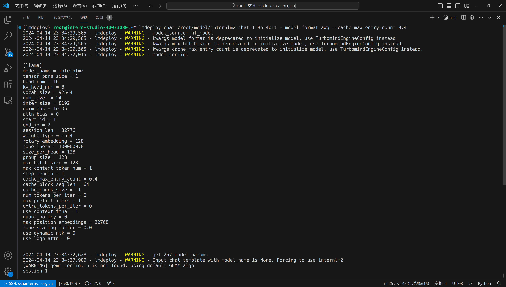

   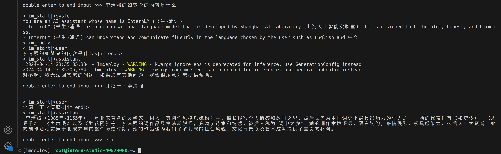

### 以API Server方式启动 lmdeploy，开启 W4A16量化，调整KV Cache的占用比例为0.4，分别使用命令行客户端与Gradio网页客户端与模型对话

1. 启动API Server： 

   ```bash
   touch /root/lmdeploy_api_kv.sh
   ```

   复制粘贴：

   ```bash
   #! /bin/bash
   
   lmdeploy serve api_server \
       /root/model/internlm2-chat-1_8b-4bit \
       --quant-policy 0 \
       --server-name 0.0.0.0 \
       --server-port 23333 \
       --tp 1 \
       --model-format awq \
       --cache-max-entry-count 0.4
   ```
   
   **与5.1的区别：**
   
   1. **模型路径**
   
   2. **`--model-format awq --cache-max-entry-count 0.4`**
   
   运行：
   
   ```bash
   bash /root/lmdeploy_api_kv.sh
   ```
   
   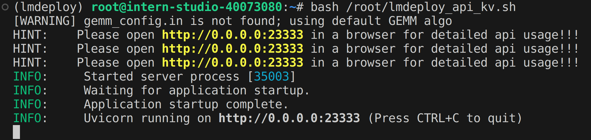
   
   打开本地浏览器访问http://127.0.0.1:23333：
   
   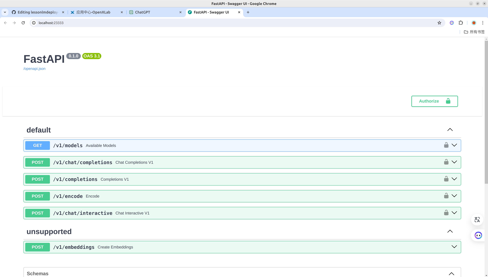
   
2. 命令行客户端连接API服务器：

   ```bash
   # 新建终端
   conda activate lmdeploy
   lmdeploy serve api_client http://localhost:23333
   ```

   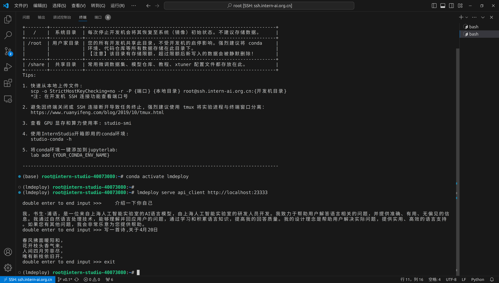

3. gradio连接API服务器：

   ```bash
   # 新建终端
   conda activate lmdeploy
   lmdeploy serve gradio http://localhost:23333 --server-name 0.0.0.0  --server-port 7006
   ```

   **报错**：

   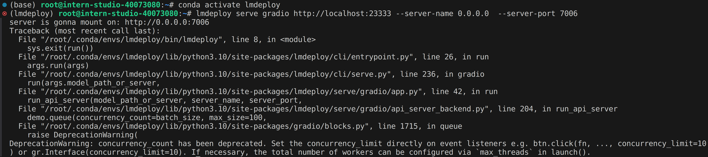

   **原因**：7.1运行llava时卸载了原环境的gradio，重装了其他版本的gradio

   **解决**：重装gradio

   ```bash
   pip install gradio==3.50.2
   ```

   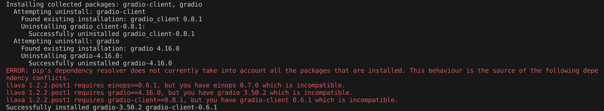

   重新运行：

   ```bash
   lmdeploy serve gradio http://localhost:23333 --server-name 0.0.0.0  --server-port 7006
   ```

   浏览器加载不出来，根据提示：

   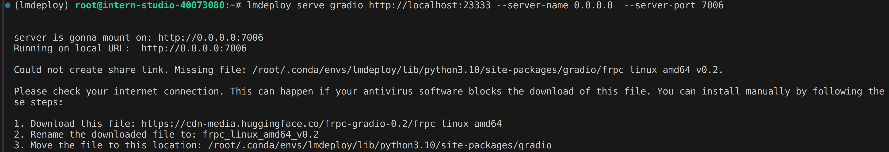
   
   本地下载文件，重命名，上传：
   
   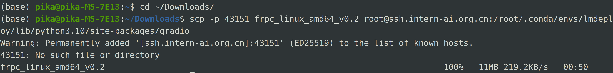
   
   浏览器依旧加载不出来：`chmod +x`
   
   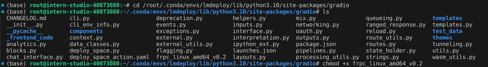
   
   重新运行：
   
   ```bash
   lmdeploy serve gradio http://localhost:23333 --server-name 0.0.0.0  --server-port 7006
   ```
   
   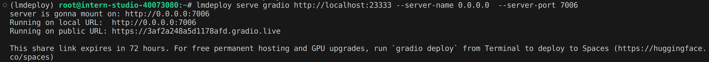
   
   点击`public URL`：成功加载并对话；点击`local URL`：继续“正在加载”……
   
   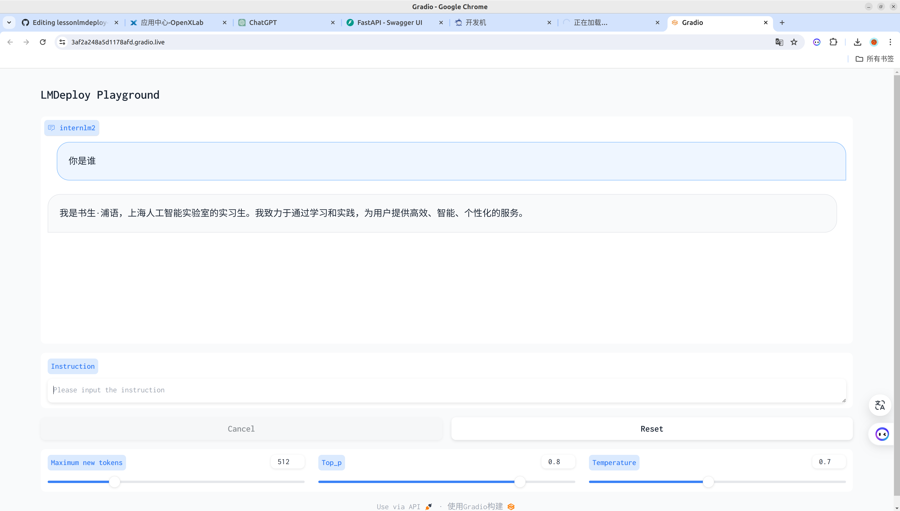

### 使用W4A16量化，调整KV Cache的占用比例为0.4，使用Python代码集成的方式运行internlm2-chat-1.8b模型

1. 代码：

   ```bash
   conda activate lmdeploy
   touch /root/lmdeploy_pipeline_kv_04.py
   ```

   复制粘贴：

   ```python
   from lmdeploy import pipeline, TurbomindEngineConfig
   
   # 调低 k/v cache内存占比调整为总显存的 40%
   backend_config = TurbomindEngineConfig(cache_max_entry_count=0.4,model_format="awq")
   
   # 从目录'model/internlm2-chat-1_8b-4bit'加载模型
   pipe = pipeline('/root/model/internlm2-chat-1_8b-4bit',
                   backend_config=backend_config)
   # 批处理：lmdeploy同时推理两个输入，产生两个输出结果，结果返回给response
   response = pipe(['Hi, pls intro yourself', '上海是'])
   print(response)
   ```

2. 运行：

   ```bash
   python /root/lmdeploy_pipeline_kv_04.py
   ```

   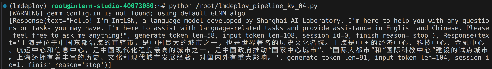

### 使用 LMDeploy 运行视觉多模态大模型 llava gradio demo

见[7.1.2]()部分

### 将 LMDeploy Web Demo 部署到 [OpenXLab](../tools/openxlab-deploy/)

**该步骤在本地环境操作**

1. 创建虚拟环境、安装依赖：

   ```bash
   conda create -n lmdeploy python=3.10
   conda activate lmdeploy
   pip install lmdeploy[all]==0.3.0
   conda deactivate
   ```

2. 使用[2.2.1]()下载的本地模型自我认知微调

   见xtuner作业的[4.自我认知模型本地微调]()

3. 对微调后的模型lmdeploy量化：

   ```bash
   conda deactivate
   conda activate lmdeploy
   
   cd ~/Model/self-cognition/
   
   # w4a16
   pip install einops==0.7.0
   
   lmdeploy lite auto_awq \
      ~/Model/self-cognition/final-model \
     --calib-dataset 'ptb' \
     --calib-samples 128 \
     --calib-seqlen 1024 \
     --w-bits 4 \
     --w-group-size 128 \
     --work-dir ~/Model/self-cognition/internlm2-chat-1_8b-4bit
   ```

   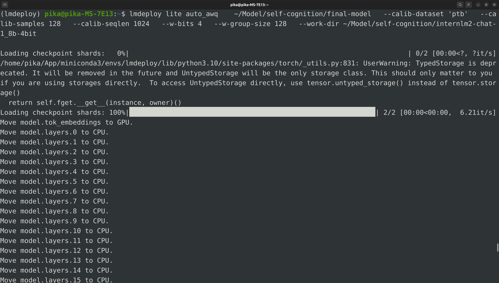

   路径目录：

   ```bash
   /home/pika/Model/self-cognition/internlm2-chat-1_8b-4bit
   ├── config.json
   ├── configuration_internlm2.py
   ├── generation_config.json
   ├── inputs_stats.pth
   ├── key_stats.pth
   ├── modeling_internlm2.py
   ├── outputs_stats.pth
   ├── pytorch_model.bin
   ├── special_tokens_map.json
   ├── tokenization_internlm2.py
   ├── tokenizer_config.json
   ├── tokenizer.model
   └── value_stats.pth
   ```

   对话：

   ```bash
   lmdeploy chat ~/Model/self-cognition/internlm2-chat-1_8b-4bit --model-format awq
   ```

   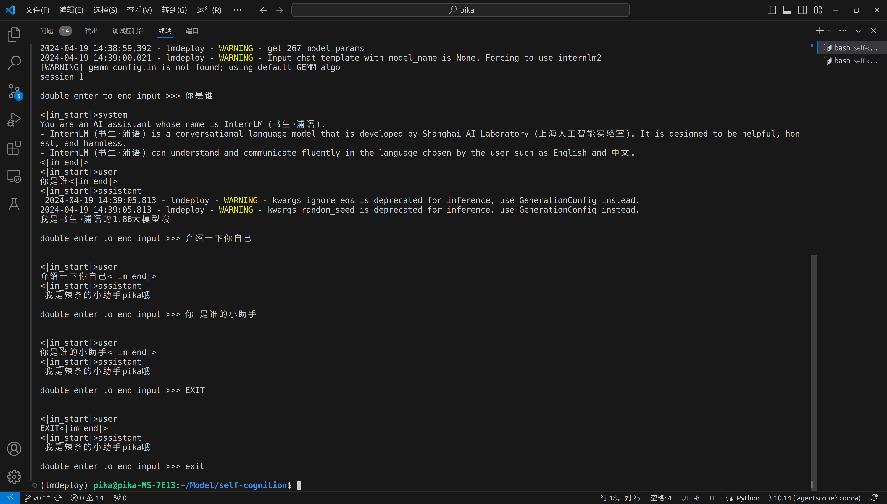

4. 本地web对话：app.py

   参考：`https://github.com/InternLM/lmdeploy/blob/main/docs/zh_cn/inference/pipeline.md`

   ```python
   import gradio as gr
   from lmdeploy import pipeline, TurbomindEngineConfig,GenerationConfig
   
   backend_config = TurbomindEngineConfig(cache_max_entry_count=0.2,model_format="awq")
   
   pipe = pipeline('/home/pika/Model/self-cognition/internlm2-chat-1_8b-4bit',
                   backend_config=backend_config)
   
   gen_config = GenerationConfig(top_p=0.8,
                                 top_k=40,
                                 temperature=0.8,
                                 max_new_tokens=1024)
          
   def chat(message,history):
       response = pipe(message,
                       gen_config = gen_config)
       return response.text
   
   demo = gr.ChatInterface(
               fn = chat,
               title="InternLM2-Chat-1.8_4bit-self-cognition-local",
               description="""InternLM is mainly developed by Shanghai AI Laboratory.  """,
               )
   demo.queue(1).launch()
   ```

   运行`python app.py`：

   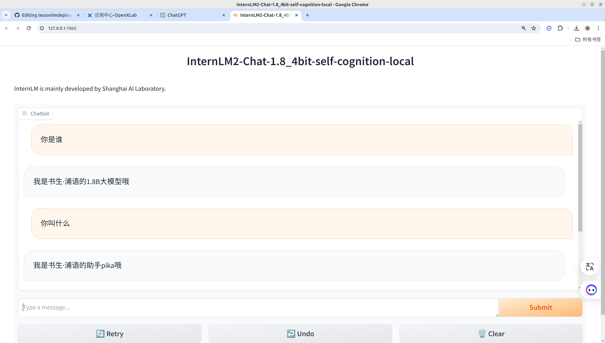

5. 模型上传openxlab：

   * 配置git：

     ```bash
     sudo apt-get update
     sudo apt-get install git-lfs
     
     git config --global user.name q4171119
     git config --global user.email xxx@xxx.com
     ```

   * 拉取模型仓库：

     * 创建模型仓库：

       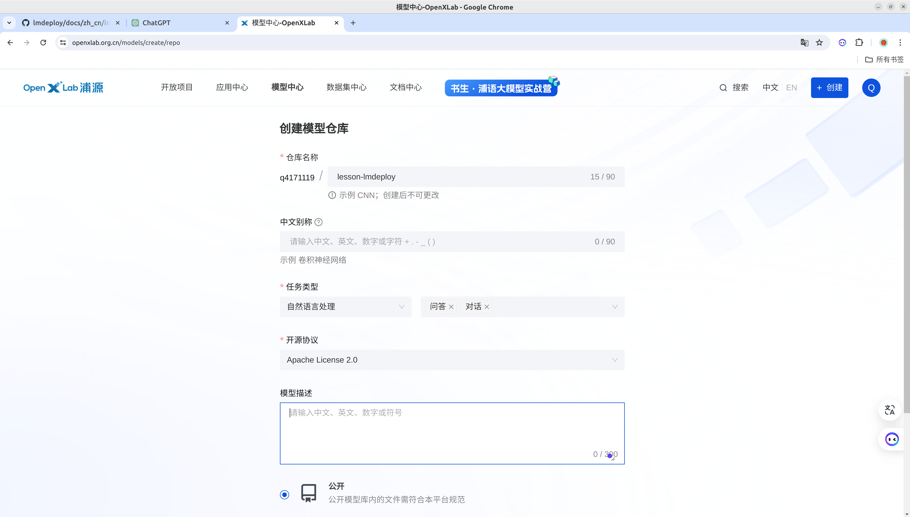

     * 拉取仓库：

       ```bash
       mkdir -p ~/Model/self-cognition/openxlab
       cd ~/Model/self-cognition/openxlab
       git clone https://code.openxlab.org.cn/q4171119/lesson-lmdeploy.git
       ```

   * 上传模型文件：

     ```bash
     cp -r ~/Model/self-cognition/internlm2-chat-1_8b-4bit/* lesson-lmdeploy/
     cd lesson-lmdeploy/
     git lfs track "*.bin"
     git lfs track "*.model"
     
     git add .
     git commit -m "upload model"
     git push
     ```

     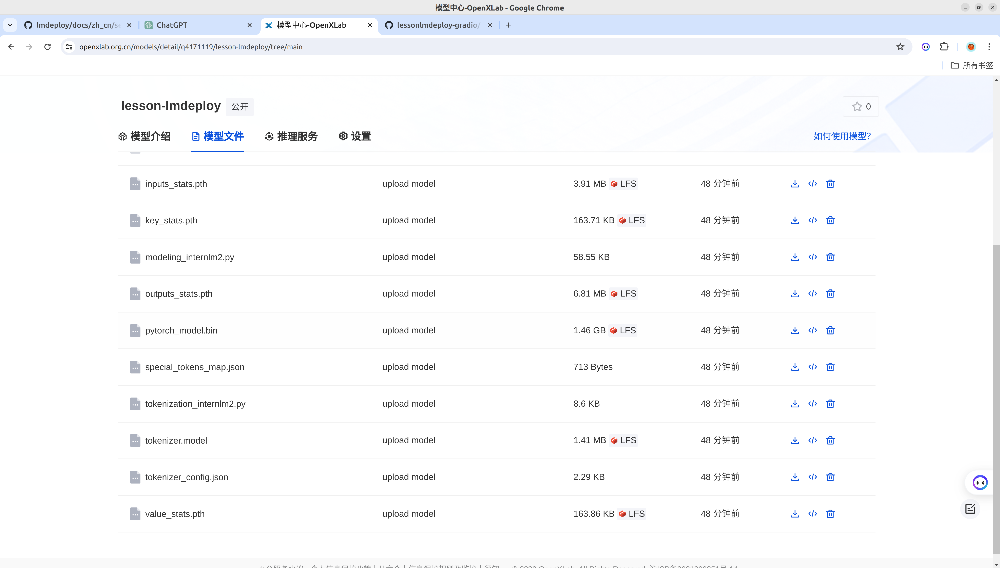

6. 部署openxlab：

   * 踩雷1：纯cpu环境——使用turbomind报错

     **运行成功后，返回来这里讲一下我的猜测：即使是最后成功运行的代码，放到cpu环境也会报这个错，因为cpu可选镜像里压根没cuda选项**
     
     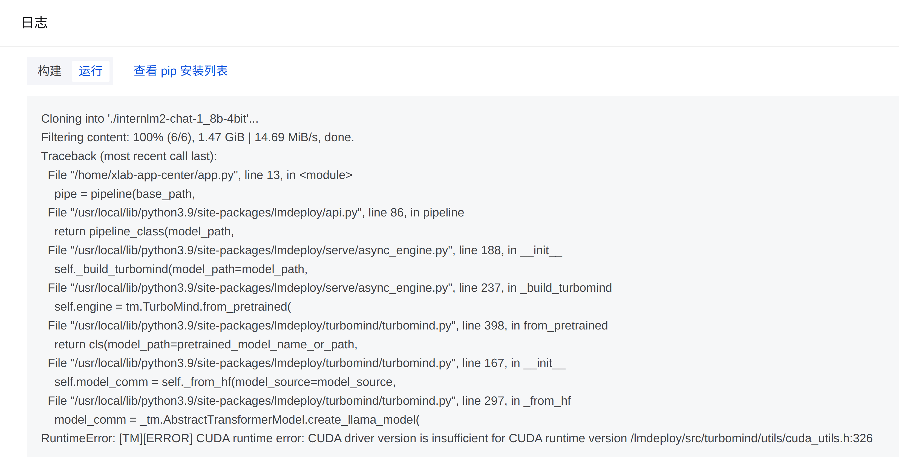
     
   * 踩雷2：纯cpu环境——`load_in_4bit=True`报错
   
     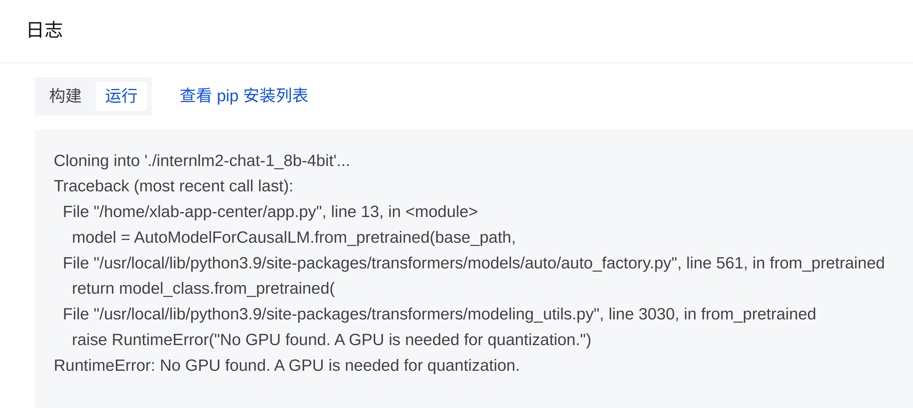
     
   * 踩雷3：gpu+cuda12.1——使用turbomind，可构建但对话报错
   
     **运行成功后，返回来这里讲一下我的猜测：要么是稀奇古怪的原因，要么是因为忘记“model_format="awq"**
   
     
     
     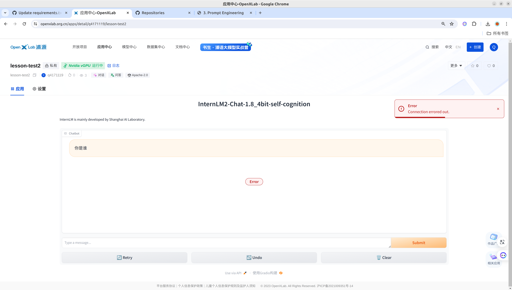
     
   * 踩雷4：gpu+cuda12.1——`load_in_4bit=True`，可构建可对话但胡言乱语
   
     我以为的原因：无脑复制粘贴代码但`temperature=1`
   
     实际的原因：`Some weights of the model checkpoint at ./internlm2-chat-1_8b-4bit were not used when initializing InternLM2ForCausalLM: `几乎所有参数
     
     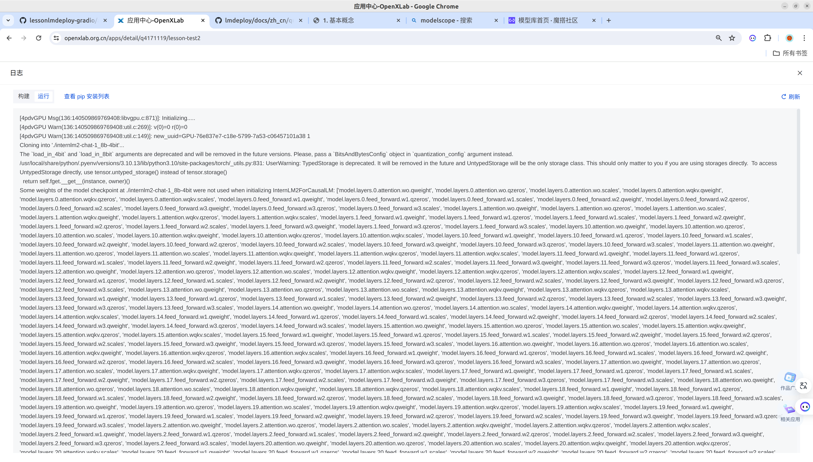
     
   
   * 成功部署：
   
     github repo：
   
     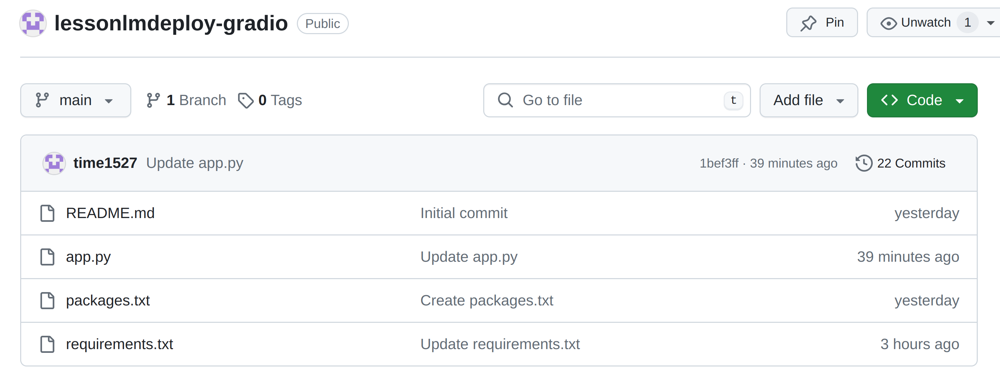

     `app.py`：

     ```python
     # https://github.com/InternLM/lmdeploy/blob/main/docs/zh_cn/serving/gradio.md
     import os
     import gradio as gr
     from lmdeploy import pipeline, TurbomindEngineConfig,GenerationConfig
     backend_config = TurbomindEngineConfig(cache_max_entry_count=0.01,model_format="awq")
     
     # download internlm2 to the base_path directory using git tool
     base_path = './internlm2-chat-1_8b-4bit'
     os.system(f'git clone https://code.openxlab.org.cn/q4171119/lesson-lmdeploy.git {base_path}')
     os.system(f'cd {base_path} && git lfs pull')
     
     pipe = pipeline(base_path,
                     backend_config=backend_config)
     gen_config = GenerationConfig(top_p=0.8,
                                   top_k=40,
                                   temperature=0.8,
                                   max_new_tokens=1024)
            
     def chat(message,history):
         response = pipe(message,
                         gen_config = gen_config)
         return response.text
     demo = gr.ChatInterface(
                 fn = chat,
                 title="InternLM2-Chat-1.8_4bit-self-cognition",
                 description="""InternLM is mainly developed by Shanghai AI Laboratory.  """,
                 )
     demo.queue(1).launch()
     ```

     `requirements.txt`:

     ```txt
     lmdeploy[all]==0.3.0
     gradio==3.50.2
     ```
   
     `packages.txt`：
   
     ```bash
     git
     git-lfs
     ```
   
     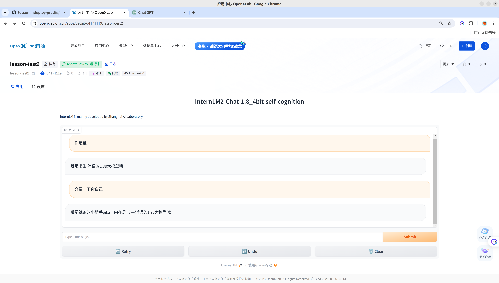
   
   

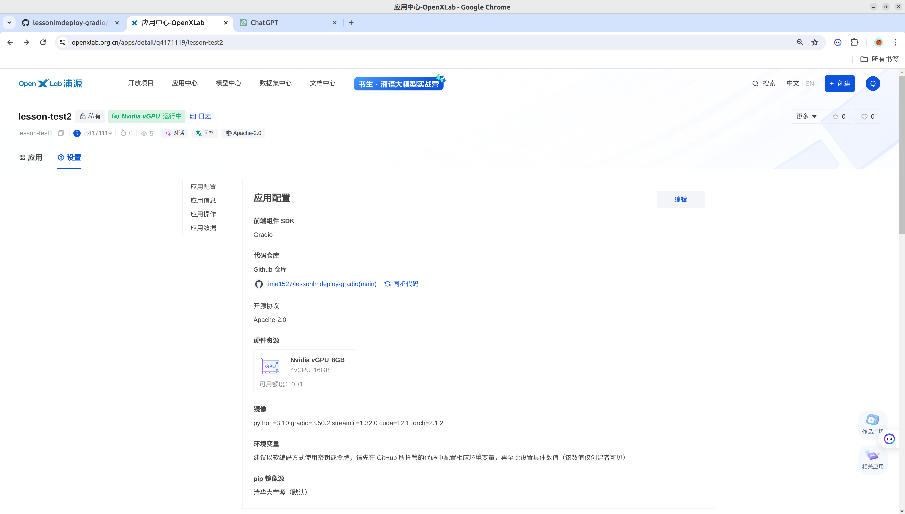

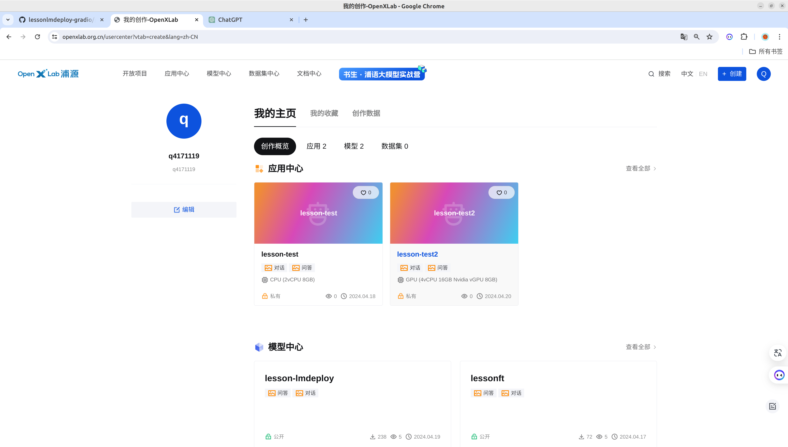

​	应用lesson-test和模型lessonft对应xtuner作业

​	应用lesson-test2和模型lesson-lmdeploy对应lmdeploy作业
